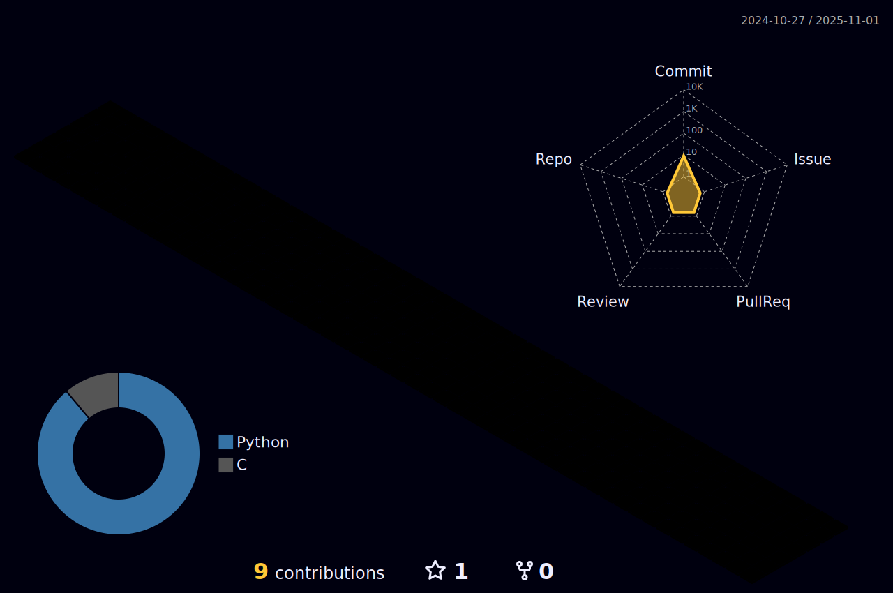

## :pushpin: 42 Cursus status

  

---

<table border="1" width=45% align=right>
	<thead align=center>
		<tr>
			<th scope="col">Project</th>
			<th scope="col">Rank</th>
			<th scope="col">Score</th>
      <th scope="col">Outstanding</th>
		</tr>
	</thead>
	<tbody align=center>
		<tr>
			<td><a>Libft</a></td>
			<td>0</td>
			<td>125/100</td>
			<td>🥉</td>
		</tr>
		<tr>
			<td><a>Printf</a></td>
			<td>1</td>
			<td>100/100</td>
			<td>✖️</td>
		</tr>
		<tr>
			<td><a>Get next line</a></td>
			<td>1</td>
			<td>125/100</td>
			<td>🥇</td>
		</tr>
		<tr>
			<td>Born2BeRoot</td>
			<td>1</td>
			<td>125/100</td>
			<td>🥉</td>
		</tr>
		<tr>
			<td><a>Minitalk</a></td>
			<td>2</td>
			<td>125/100</td>
			<td>🥉</td>
		</tr>
		<tr>
			<td><a>fract-ol</a></td>
			<td>2</td>
			<td>115/100</td>
			<td>✖️</td>
		</tr>
		<tr>
			<td><a>Push Swap</a></td>
			<td>2</td>
			<td>84/100</td>
			<td>✖️</td>
		</tr>
		<tr>
			<td><a>Philosphers</a></td>
			<td>3</td>
			<td>100/100</td>
			<td>🥈</td>
		</tr>
		<tr>
			<td><a>Minishell</a> w/<a href="https://github.com/YastMe">abeltran</a></td>
			<td>3</td>
			<td>101/100</td>
			<td>🥈</td>
		</tr>
		<tr>
			<td><a>Net Practice</a></td>
			<td>4</td>
			<td>100/100</td>
			<td>🥇</td>
		</tr>
		<tr>
			<td><a>cub3D</a> w/<a href="https://github.com/YastMe">abeltran</a></a></td>
			<td>4</td>
			<td>120/100</td>
			<td>🥉</td>
		</tr>
		<tr>
			<td><a>miniRT</a> w/<a href="https://github.com/YastMe">abeltran</a></a></td>
			<td>4</td>
			<td>UNFINISHED</td>
			<td>UNFINISHED</td>
		</tr>
	</tbody>
</table>

<h3 align="center">🚀💻Technologies & Tools</h3>

